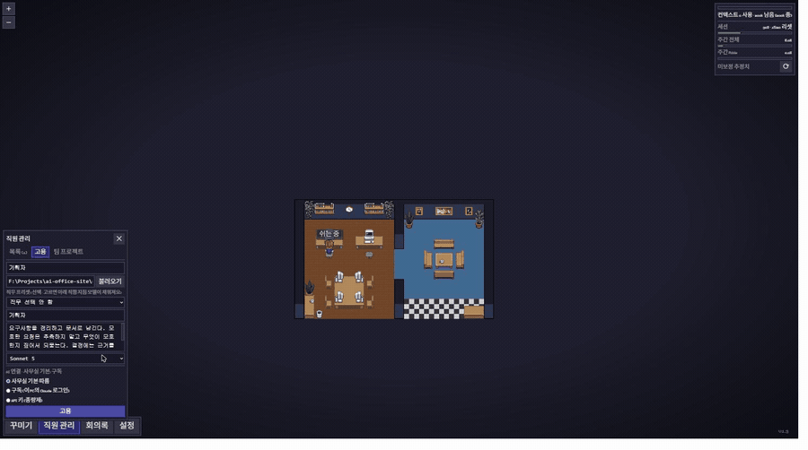

<h1 align="center">AI 오피스</h1>

<p align="center"><b>AI 에이전트를 "직원"으로 고용해 일 시키고, 결재로 통제하는 픽셀 사무실</b></p>

<p align="center">
  
  
  
  
  
  
  
</p>

<p align="center">
  <a href="https://github.com/pixel-agents-hq/pixel-agents">Pixel Agents</a>(MIT) 기반 · Powered by Claude
</p>

---

<p align="center">
  
</p>
<p align="center"><sub><b>AI 오피스로 AI 오피스 소개 사이트를 만든 실제 기록.</b> 팀 템플릿으로 기획·개발·마케팅 <b>파트별 고용</b> → 직원마다 지침서 작성 → 팀장에게 <b>목표만</b> 전달 → 팀장이 셋에게 <b>동시에</b> 위임하고 <code>BOARD.md</code>에 배분·수거를 기록 → 파일을 건드릴 때마다 <b>결재가 나에게</b> → 마지막 화면이 그렇게 완성된 사이트다.</sub></p>

## 한 줄 요약

**AI 에이전트 여러 개를 픽셀 사무실의 직원으로 만들어, 브라우저에서 지시하고 결재로 통제하는 로컬 도구.**
직원을 고용하면 AI 세션이 열리고, 캐릭터를 클릭하면 그 직원의 채팅창이 열립니다. 직원이 파일을 고치려 하면 **머리 위에 말풍선이 뜨고, 내가 승인해야만 실행**됩니다.

전부 내 컴퓨터에서 돕니다. 외부 서버도, 계정 가입도 없습니다.

## 왜 만들었나

Claude Code로 AI 팀(코더·디자이너·테스터)을 굴리다 보니 **팀원들이 지금 뭘 하고 있는지 볼 방법이 없었습니다.** 터미널을 분할해서 보는 방식은 Windows에서 안 되고, 결재 요청이 어디서 올라왔는지도 창을 다 열어봐야 알 수 있었습니다.

그래서 **사무실**로 만들었습니다. 직원이 코드를 쓰면 캐릭터가 타이핑하고, 파일을 찾으면 책을 읽고, 결재가 필요하면 말풍선을 띄우고 기다립니다. **화면만 보면 누가 뭘 하는지, 누가 내 결재를 기다리는지 압니다.**

## 원본(Pixel Agents)에 내가 얹은 것

원본은 **AI 세션을 구경만 하는 도구**였습니다. 여기에 **AI에게 실제로 일을 시키는 구조**를 얹었습니다.

| 기능                 | 내용                                                                                                                                                                         |
| -------------------- | ---------------------------------------------------------------------------------------------------------------------------------------------------------------------------- |
| **직원 = 세션**      | 고용하면 AI 상주 세션이 열림. 캐릭터 클릭 = 그 직원의 채팅창. 여러 직원과 동시에 대화하며 **기억은 완전히 분리**                                                             |
| **결재 시스템**      | 직원이 파일 쓰기·명령 실행을 하려면 **내 승인 필요.** 말풍선이 곧 결재함. 도구를 병렬로 호출하면 결재가 큐로 쌓이고 "대기 N건"으로 보임                                      |
| **팀장과 위임**      | 팀장을 두면 팀원 여럿에게 **동시에**(비블로킹 팬아웃) 일을 나눠 시키고 결과를 모아 보고. 목표만 주면 팀장이 누구에게 시킬지 스스로 정한다. 단, **결재는 언제나 나에게** 온다 |
| **직무 프리셋**      | 직무(개발자·디자이너·기획자·마케터·테스터)를 고르면 직함·기본 지침·추천 모델이 자동으로 채워짐. 지침은 직원별로 다시 쓸 수 있음                                              |
| **공유 회의보드**    | 팀장·팀원이 같은 `BOARD.md`에 배분과 결과를 기록. 누가 뭘 맡았는지가 파일 하나에 남아 세션이 끊겨도 이어짐                                                                   |
| **대시보드 탭**      | 회의록 창 안에서 직원 현황·라이브 피드·팀 흐름 캔버스를 봄. 별도 창을 띄우지 않음                                                                                            |
| **출퇴근**           | 직원을 해고하지 않고 퇴근시켜 세션만 접어둠. 다시 출근시키면 그 직원으로 복귀                                                                                                |
| **온보딩 마법사**    | Claude Code 설치·로그인 상태를 먼저 진단하고 안내. 전제조건이 없으면 고용이 조용히 실패하던 문제를 없앰                                                                      |
| **AI 연결 설정**     | 구독 / API 키 2가지. 사무실 기본값 + 직원별 덮어쓰기                                                                                                                         |
| **직원별 모델 전환** | 직원마다 다른 모델(실행 중 세션도 즉시 전환) — 업무에 맞게 배치해 비용 절감                                                                                                  |
| **사용량 게이지**    | 구독 소진율을 실측으로 보정, API 키 직원은 누적 비용($) 표시                                                                                                                 |
| **데스크톱 앱**      | 브라우저 없이 창으로 실행. 창을 닫아도 트레이에서 계속 돌고 Windows 설치 파일로도 빌드된다                                                                                   |
| 한글 UI              | 전체 인터페이스 한글화                                                                                                                                                       |

## 내가 내린 설계 결정 (그리고 그 이유)

이 프로젝트에서 **코드보다 먼저 정한 것들**입니다.

**1. 폴더가 곧 조직도다**
직원마다 담당 폴더를 준다. 상위 폴더 담당이 팀장, 하위 폴더 담당이 팀원. 권한 범위가 직급과 **저절로** 일치한다 — 억지 은유가 아니라 실제 구조가 그렇다.

**2. 말풍선이 곧 결재함이다**
승인 대기 목록을 따로 만들 수도 있었지만 만들지 않았다. **사무실 은유 자체가 이미 대기열**이기 때문이다. 말풍선은 클릭으로 사라지지 않고 결재(허용/거부)로만 사라진다. 창을 다 닫아둬도 사무실 화면만 보면 누가 기다리는지 안다.

**3. 결재권은 언제나 사용자에게**
팀장이 팀원에게 일을 시켜도, 팀원이 파일을 고치려면 **내 승인**을 받는다. 위임을 만들면서 결재까지 위임하고 싶은 유혹이 있었지만, 그러면 **내가 모르는 사이에 파일이 바뀐다.** 이 도구의 존재 이유가 없어진다.

**4. 사무실엔 내가 고용한 직원만 존재한다**
원본은 폴더를 감시해서 새 세션이 보이면 캐릭터를 만들었다. 그대로 두면 **내가 터미널에서 켠 세션까지 사무실에 밀려 들어온다.** 그래서 폴더 감시를 걷어내고, **직원을 고용하는 순간에만** 캐릭터를 붙였다. 외모는 캐릭터 팩에서 무작위로 배정하되 **직원마다 고정**해서, 한 번 본 얼굴로 계속 알아본다.

**5. 팀장은 진짜 팀원에게 시킨다 — 유령을 만들지 않는다**
Claude에는 세션 안에서 임시 하위 에이전트를 만드는 내장 도구가 있다. 팀장이 그걸 쓰면 병렬로 일은 되지만 **사무실에 없는 유령이 일하고, 정작 고용한 팀원은 논다.** 이 앱의 핵심이 "고용한 팀원이 실제로 움직이는 것"이라, 팀장에게서 그 내장 도구를 **막고** 위임 도구만 남겼다. 그래서 목표를 주면 팀장이 반드시 **실제 팀원**에게 나눠준다.

**6. 다른 AI는 아직 붙이지 않았다 — 대신 갈아끼울 자리만 만들었다**
"직원이라면 이 다섯 가지는 할 줄 알아야 한다"만 정의하고, Claude 전용 코드는 **파일 하나 안에 가뒀다.** 두 번째 AI를 붙일 때 사무실·결재·조직도 코드는 건드리지 않아도 된다.
다만 **아직 두 번째는 없다.** 이 SDK가 도구·실행 루프·권한 체계를 통째로 주기 때문에, 다른 AI를 붙이는 건 모델 교체가 아니라 **손발을 새로 만드는 일**이다. 검증 안 된 구조 위에 둘을 동시에 지으면 둘 다 부실해진다고 판단해 **하나로 갔다.**

## 기술 스택

| 영역       | 사용                                                                                           |
| ---------- | ---------------------------------------------------------------------------------------------- |
| 프론트엔드 | React 19, TypeScript, Canvas 2D (픽셀 렌더링)                                                  |
| 백엔드     | Node.js, Fastify, WebSocket                                                                    |
| AI 연동    | Claude Agent SDK (상주 세션·도구 승인·모델 전환·위임), Claude Code Hooks                       |
| 통신       | 서버→모든 화면 실시간 방송. 탭을 여러 개 열어도 같은 사무실을 봄                               |
| 저장       | 홈 디렉토리에 JSON (직원 명부·레이아웃·설정). 비밀 값은 권한 0600, **저장소에 절대 안 들어감** |
| 테스트     | Vitest 단위 (서버 394 · 웹뷰 137, 전부 통과 — 3건 skip), Playwright E2E                        |
| 배포       | Electron (데스크톱 셸·트레이 상주), electron-builder (Windows 설치 파일)                       |

## 실행

> [!NOTE]
> 자체 코드 점검 4라운드로 **결함 23건을 찾아 수정 완료**(스모크 테스트 통과, 실사용 회귀 없음). 배포용 설치본은 아직 없어 **소스 빌드로 실행**합니다.

### 브라우저로

```bash
git clone https://github.com/dtada11/ai-office.git
cd ai-office
npm install
npm run build
node dist/cli.js --port 3100
```

브라우저에서 `http://localhost:3100` → 직원 패널에서 이름·담당 폴더를 넣고 고용.

### 데스크톱 앱

터미널과 브라우저 없이 창 하나로 쓰려면 데스크톱 앱으로 빌드할 수 있습니다. `npm run desktop:dev`는 개발 중에 Electron 창을 바로 띄우고, `npm run desktop:dist`는 Windows 설치 파일을 `release/` 폴더에 만듭니다. 이 설치 파일 하나에 앱이 도는 데 필요한 게 전부 들어 있어서(런타임·서버·에셋), 받는 사람은 그 파일만 더블클릭하면 됩니다. 창을 닫아도 사무실은 트레이에 남아 계속 돌고, 트레이 아이콘을 누르면 다시 열립니다. 인증은 설치 파일에서도 본인 것을 씁니다. 브라우저로 쓸 때와 같은 전제입니다.

**요구사항**: Node.js 18+, 그리고 [Claude Code CLI](https://code.claude.com/docs) 로그인(구독 모드) 또는 Anthropic API 키.

---

## 솔직히 밝힙니다

- **이건 [pixel-agents](https://github.com/pixel-agents-hq/pixel-agents)(MIT, 2026년 2월 시작) 기반입니다.** 2026년 7월 11일부터 작업했고, 포크 시점(`928ccd4`) 이후 **커밋 129개·파일 187개·+27,418 / −32,193줄**입니다. 삭제가 추가보다 많은 건 기능을 걷어내서가 아니라, 1인 도구에 미리 깔려 있던 확장 설비(코드생성 파이프라인·리포트 대시보드·구현체 하나뿐인 인터페이스)를 정리했기 때문입니다.
- **설계 결정은 제가, 구현은 AI와 협업했습니다.** 위의 "설계 결정"은 전부 제가 판단하고 지시한 것이고, 각 결정의 근거는 작업 로그에 남겼습니다. 코드를 읽고 설명하는 훈련을 병행하고 있습니다.
- **아직 안 되는 것**: 다른 회사 AI(GPT·Gemini) 연결, 자동 업데이트.
  - **외부 기기 원격 접속**: 접속한 쪽이 누구인지 확인하는 절차가 아직 없어서, 포트를 loopback에만
    열어두고 있습니다. 같은 기기에서만 쓰는 걸 전제로 만들었습니다.

## 크레딧 / 라이선스

- 원본: [pixel-agents-hq/pixel-agents](https://github.com/pixel-agents-hq/pixel-agents) (MIT)
- 캐릭터 도트 기반: [JIK-A-4, Metro City 캐릭터 팩](https://jik-a-4.itch.io/metrocity-free-topdown-character-pack)
- [MIT](LICENSE) — 원본 라이선스를 그대로 따릅니다.
